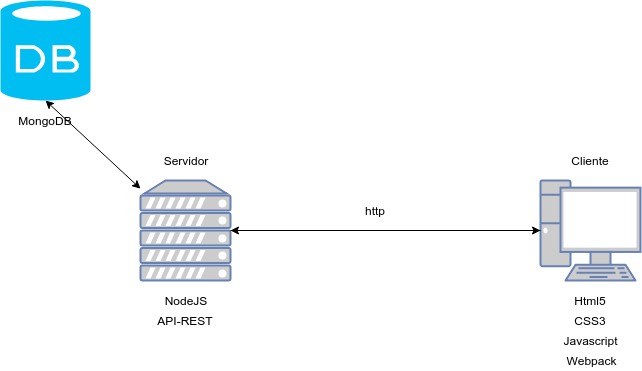

# app-libros
Aplicación SPA de una tienda de libros usando Javascript Fullstack y MongoDB
## Arquitectura de la aplicación

## Dependencias del proyecto
[express](https://www.npmjs.com/package/express): Framework web rápido, minimalista y sin opciones para node.

[mongoose](https://www.npmjs.com/package/mongoose): Es una herramienta de modelado de objetos MongoDB diseñada para trabajar en un entorno asíncrono.

[morgan](https://www.npmjs.com/package/morgan): Middleware del logger de petición HTTP para node.js

[multer](https://www.npmjs.com/package/multer): Es un middleware node.js para el manejo de datos multiparte/formato, que se utiliza principalmente para la carga de archivos.

[dotenv](https://www.npmjs.com/package/dotenv): Es un módulo de dependencia cero que carga variables de entorno de un archivo.env en process.env.

[cross-env](https://www.npmjs.com/package/cross-env): Ejecutar scripts que establecen y utilizan variables de entorno en todas las plataformas

[cors](https://www.npmjs.com/package/cors): Es un paquete node.js para proporcionar un middleware Connect/Express que puede ser usado para habilitar CORS con varias opciones.

[fs-extra](https://www.npmjs.com/package/fs-extra): Añade métodos de sistema de ficheros que no están incluidos en el módulo nativo de fs y añade soporte de promesa a los métodos de fs.

## Dependencias de desarrollo del proyecto
[eslint](https://www.npmjs.com/package/eslint): Es una herramienta para identificar y reportar patrones encontrados en el código ECMAScript/JavaScript. En muchos sentidos, es similar a JSLint y JSHint.

[webpack](https://www.npmjs.com/package/webpack): Es un empaquetador de módulos. Su objetivo principal es agrupar archivos JavaScript para su uso en un navegador, pero también es capaz de transformar, agrupar o empaquetar prácticamente cualquier recurso o activo.

[webpack-cli](https://www.npmjs.com/package/webpack-cli): Proporciona un conjunto flexible de comandos para que los desarrolladores aumenten la velocidad al configurar un proyecto webpack personalizado.

[html-webpack-plugin](https://www.npmjs.com/package/html-webpack-plugin): Plugin que simplifica la creación de archivos HTML para servir a sus paquetes.

[css-loader](https://www.npmjs.com/package/css-loader): Interpreta @import y url() como import/require() y los resolverá.

[style.loader](https://www.npmjs.com/package/style-loader): Añade CSS al DOM inyectando un tag `<style>`.

[mini-css-extract-plugin](https://www.npmjs.com/package/mini-css-extract-plugin): Este plugin extrae CSS en archivos separados. Crea un archivo CSS por archivo JS que contiene CSS. Soporta carga bajo demanda de CSS y SourceMaps.

[webpack-dev-server](https://www.npmjs.com/package/webpack-dev-server): Utilice webpack con un servidor de desarrollo que proporciona recarga en vivo. Esto debe utilizarse únicamente para el desarrollo.

[timeago.js](https://www.npmjs.com/package/timeago.js): Se usa para formatear datetime con la sentencia *** time ago. ejemplo: '3 hours ago'.

## Frameworks y librerías para el frontend

[Bootstrap 4](https://getbootstrap.com/docs/4.3/getting-started/introduction/): Es un kit de herramientas de código abierto para el desarrollo con HTML, CSS y JS.

[jquery](https://api.jquery.com/): Es una biblioteca JavaScript rápida, pequeña y rica en funciones. Hace que cosas como la travesía y manipulación de documentos HTML, el manejo de eventos, la animación y Ajax sean mucho más simples con una API fácil de usar que funciona en una multitud de navegadores.

[Animate.css](https://github.com/daneden/animate.css): Es un montón de animaciones divertidas y divertidas para que las uses en tus proyectos. Excelente para enfatizar, páginas de inicio, deslizadores, y en general, simplemente añadir agua.

## Herramientas de despliegue
[MongoDB Atlas](https://www.mongodb.com/cloud/atlas): Servicio MongoDB en nube automatizado creado para equipos ágiles que prefieren dedicar su tiempo a la creación de aplicaciones que a la gestión de bases de datos. Disponible en AWS, Azure y GCP.

[Heroku]([https://www.mongodb.com/cloud/atlas](https://www.heroku.com/)): Aprende a construir, desplegar y administrar tus aplicaciones en Heroku.

## Vista de la aplicación

## Comando utilizados
// Ejecutar el servidor en modo desarrollo (Tener instalado nodemon)
`$ npm run dev`

// Ejecutar webpack en modo desarrollo
`$ npm run client:dev`

// Ejecutar webpack en modo producción
`$ npm run build`